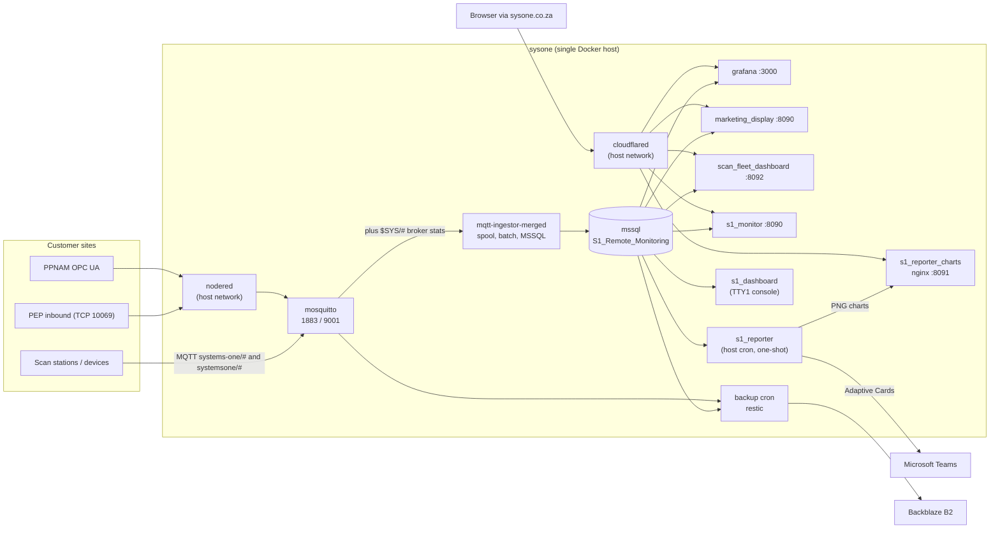

# Systems-One-Server

Ansible repository that builds and runs the Systems One remote-monitoring platform on a
single production host (`sysone`, also known as `s1_server`). Every service is a Docker
container deployed by an Ansible role in this repo. The host manages itself (Ansible runs
on-box with `ansible_connection: local`) and is reached from the internet through a
Cloudflare Tunnel on `sysone.co.za`.

What the platform does: scan stations at customer sites publish telemetry over MQTT. The
server ingests it into SQL Server, and a set of dashboards and a Teams reporter turn it into
fleet health, throughput and scan-quality views.

- [Architecture](#architecture)
- [Host and network layout](#host-and-network-layout)
- [Services](#services)
- [Data](#data)
- [Public exposure (Cloudflare Tunnel)](#public-exposure-cloudflare-tunnel)
- [Also on the box, not managed here](#also-on-the-box-not-managed-here)
- [Repository layout](#repository-layout)
- [Deploying](#deploying)
- [Secrets](#secrets)
- [Backups](#backups)
- [Tests and CI](#tests-and-ci)
- [Grafana](#grafana)
- [Known rough edges](#known-rough-edges)

## Architecture



Data path in one line: **device to Mosquitto to mqtt_ingestor to SQL Server to Grafana,
dashboards and reporter**.

## Host and network layout

One Ubuntu host runs everything. Two Ansible plays target it, both resolving to the same
machine in the `production` inventory:

| Play | Group | Roles (in order) |
|---|---|---|
| `webservers.yml` | `webservers` | `docker`, `cloudflared`, `grafana`, `mqtt`, `nodered`, `mqtt_ingestor`, `s1_dashboard`, `s1_reporter`, `marketing_display`, `scan_fleet_dashboard`, `s1_monitor`, `s1_baselines` |
| `dbservers.yml` | `dbservers` | `docker`, `mssql`, `backup` |

`site.yml` imports both. `staging` is a second inventory with the same group layout
(`sysone_staging`).

**Docker networking.** All compose stacks join one external bridge network, `infra`
(`docker_shared_network` in `group_vars/all.yml`), so containers reach each other by name
(`mssql`, `mosquitto`). Two containers run in `network_mode: host` instead:

- `cloudflared` (production only, see `host_vars/sysone.yml`). Because it is on the host
  stack it **cannot resolve container names**. Anything routed through the tunnel must
  publish a loopback port, and the Cloudflare public hostname must point at
  `localhost:<port>`.
- `nodered` (production). Its TCP listener for inbound PEP devices binds directly on the
  host. Staging runs Node-RED in bridge mode and publishes ports explicitly.

**Host port map (production, confirmed with `docker ps` on 2026-09-09):**

| Host bind | Container | Purpose | Reachable from |
|---|---|---|---|
| `0.0.0.0:1883` | mosquitto | MQTT (TCP) | Internet / devices |
| `0.0.0.0:9001` | mosquitto | MQTT over WebSockets | Internet / devices |
| `0.0.0.0:1433` | mssql | SQL Server | LAN |
| `0.0.0.0:8084` | mqtt-ingestor-merged | ingestor `/health` (container port 8080) | LAN |
| `0.0.0.0:9111` | mqtt-ingestor-merged | Prometheus metrics (container port 9108) | LAN |
| `*:10069` | nodered (host net) | PEP inbound device TCP server | Internet / devices |
| `127.0.0.1:1880` | nodered (host net) | Node-RED editor | Loopback / tunnel |
| `127.0.0.1:3000` | grafana | Grafana UI | Loopback / tunnel |
| `127.0.0.1:8090` | marketing_display | Status page (container port 8000) | Loopback / tunnel |
| `127.0.0.1:8091` | s1_reporter_charts | Report chart PNGs (nginx) | Loopback / tunnel |
| `127.0.0.1:8092` | scan_fleet_dashboard | Fleet dashboard API (container port 8000) | Loopback / tunnel |
| `127.0.0.1:8093` | s1_monitor | new status site (container port 8000), moves to 8090 at cutover | Loopback / tunnel |

`scan_fleet_dashboard` defaults to 8091 but is pinned to 8092 in `host_vars/sysone.yml`
because 8091 is already owned by the chart server.

## Services

Each role renders a `docker-compose.yml` under `/opt/<service>` on the host and runs
`docker compose up -d`. Application code lives in the role's `files/` directory and is
built into an image on the host.

| Role | Container | Image | Install dir | What it does |
|---|---|---|---|---|
| `docker` | none | none | none | Installs Docker Engine and the Compose plugin, creates the `infra` network, adds the deploy user to the `docker` group. |
| `cloudflared` | `cloudflared` | `cloudflare/cloudflared` | `/opt/cloudflared` | Cloudflare Tunnel client. Token from vault. Host network mode in production. |
| `mqtt` | `mosquitto` | `eclipse-mosquitto:2` | `/opt/mqtt` | MQTT broker with persistence and password auth only (no anonymous). Ports 1883 and 9001. The password file is regenerated whenever the vault credentials change. `mosquitto_max_packet_size` caps packet size. |
| `mqtt_ingestor` | `mqtt-ingestor-merged` | built `mqtt-ingestor-merged:latest` | `/opt/mqtt_ingestor` | The single ingest process. One MQTT client subscribed to `systems-one/#`, `systemsone/#` and `$SYS/#`. Device telemetry goes to `dbo.*` tables and broker stats to `broker.broker_stats`, through a SQLite spool, a batched writer, retry with backoff and a dead-letter table. Optional customer/location allowlist. Exposes `/health` and Prometheus metrics. |
| `mssql` | `mssql` | `mcr.microsoft.com/mssql/server:2022-latest` | `/opt/mssql` | SQL Server Developer edition. Creates `S1_Remote_Monitoring`, the `admin` application login and the `dbo.*` schema from `bootstrap.remote_monitoring.sql.j2`. A second bootstrap for a legacy `Systems_One` database exists but only runs when `mssql_bootstrap_enabled` is true. |
| `nodered` | `nodered` | `nodered/node-red` | `/opt/nodered` | Two flows from `files/flows.json`: **PEP Inbound Server** (TCP server on 10069 for devices that speak raw TCP rather than MQTT) and **PPNAM Station 2 MQTT** (OPC UA endpoints republished to MQTT). Flows and `settings.js` are provisioned from the repo unless Projects mode is enabled. |
| `grafana` | `grafana` | `grafana/grafana-oss` | `/opt/grafana` | Broker and system health dashboards over an MSSQL datasource. Dashboards come from a separate repo via Grafana Git Sync, and orgs and users are provisioned through the HTTP API on each deploy. See [Grafana](#grafana). |
| `marketing_display` | `marketing_display` | built `marketing-display:latest` | `/opt/marketing-display` | FastAPI plus static HTML and Chart.js "S1 Remote Monitoring" status page (`/` and `history.html`). Read-only over the RM database with a 30 s cache. |
| `scan_fleet_dashboard` | `scan_fleet_dashboard` | built `scan-fleet-dashboard:latest` | `/opt/scan-fleet-dashboard` | FastAPI JSON API for the fleet dashboard: customers, machines, performance, throughput KPIs, intraday and per-machine views, per-customer thresholds and optional per-user customer scoping (`AUTH_ENABLED`). Runs side-by-side with `marketing_display` until cutover. |
| `s1_monitor` | `s1_monitor` | built `s1-monitor:latest` | `/opt/s1-monitor` | FastAPI plus static ECharts site "S1 Remote Monitoring" for fault diagnosis: Fleet, Device (summary, errors, daily figures, throughput heatmap, comparison, downloads), Trends. Records host health snapshots into `dbo.device_health_history` every 15 min. Replaces `marketing_display` and `scan_fleet_dashboard` at cutover. |
| `s1_reporter` | one-shot `reporter` via `compose run`, plus `s1_reporter_charts` | built `s1-reporter:latest`, `nginx:alpine` | `/opt/s1-reporter` | Teams alerts and reports as host-cron jobs: `sync-status` every 20 min, `check-alerts` every 20 min on weekdays, `daily` 06:00 weekdays, `monthly` on the 1st, `stale-digest` Monday 07:00. Customer capabilities and limits live in `dbo.customer_config`; per-device `reporting_enabled` and `muted_until` on `dbo.devices`. Chart PNGs served by nginx as `charts.sysone.co.za`. |
| `s1_baselines` | none (one-shot via `compose run`) | built `s1-baselines:latest` | `/opt/s1-baselines` | Recomputes `dbo.alert_thresholds` from 60 days of `device_statistics`. Host cron runs `run-baselines.sh apply` every Sunday 02:00; operators run `sudo /opt/s1-baselines/run-baselines.sh dry-run` to preview (the compose file and log are root-owned). Owns the table's DDL via `migrate`. |
| `s1_dashboard` | none (host process) | none | `/opt/s1-dashboard` | Stdlib-only Python status screen on the physical console. Configures `getty@tty1` autologin for the deploy user and launches the dashboard from `.profile`. Shows today/week/year scan totals, host metrics, Docker health and a problems-only log pane. |
| `backup` | none (cron) | `restic/restic:0.17` | `/opt/backup` | Nightly 02:30 restic backup of the RM database (`.bak`) and the Mosquitto volume to Backblaze B2. A pre-deploy gate in both plays refuses to run if the last successful backup is older than `backup_gate_max_age_hours`. Off by default (`backup_enabled: false`). See `roles/backup/README.md`. |
| `systems_one_ingest` | none | none | none | **Retired.** The original ingestor, superseded by `mqtt_ingestor`. Not referenced by any play. The role and its tests are still in the repo. |

Which service talks to what:

| Consumer | Reads / writes | Login used |
|---|---|---|
| `mqtt_ingestor` | writes `dbo.*`, `broker.broker_stats`, `ingest.*` | `mssql_rm_admin_login` (`admin`) |
| `marketing_display`, `scan_fleet_dashboard`, `s1_dashboard` | read `S1_Remote_Monitoring` | `admin` |
| `grafana` | reads `S1_Remote_Monitoring` via the provisioned MSSQL datasource | `admin` |
| `s1_reporter` | reads telemetry, `customer_config`, `alert_thresholds`; writes `dbo.device_status` | `admin` |
| `s1_baselines` | reads `device_statistics`, writes `alert_thresholds` | `admin` |
| `nodered` | publishes to `mosquitto` | vault MQTT user |
| `backup` | dumps `mssql`, tars the Mosquitto volume | `sa` inside the container |

## Data

One database, `S1_Remote_Monitoring`, on the `mssql` container. The schema is created by
`roles/mssql/templates/bootstrap.remote_monitoring.sql.j2` and extended by
`roles/mqtt_ingestor/files/app/migrations/001_init_schema.sql`.

| Schema.table | Written by | Purpose |
|---|---|---|
| `dbo.devices` | ingestor | Device registry keyed by customer, location and machine name. Machine names such as `DIM1` repeat across sites, so the key is the triple. |
| `dbo.device_status` | ingestor, reporter | Latest online/offline state per device. |
| `dbo.device_application_status`, `device_os_status`, `device_uptime_status`, `device_storage_status`, `device_os_metrics` | ingestor | Latest per-device application, OS, uptime, storage and OS-metric snapshots (MERGE upserts). |
| `dbo.device_statistics` | ingestor | Append-only scan statistics per interval: items, good reads, no-dim and so on. Source for every dashboard and report. |
| `broker.broker_stats` | ingestor | Mosquitto `$SYS` snapshots. |
| `dbo.customer_config` | reporter `migrate`, edited by hand | Per-customer capabilities (dimension, weight, hand scan) and alert limits. |
| `dbo.alert_thresholds` | `s1_baselines` | Per-device warn/bad thresholds from 60-day baselines. |
| `dbo.device_health_history` | `s1_monitor` | 15-minute host health snapshots: status, app running, uptime, CPU, memory, temperature, drive usage. |
| `ingest.pipeline_state`, `ingest.telemetry_deadletter` | ingestor | Pipeline bookkeeping and messages that failed every retry. |
| `dbo.DailyStats`, `driver_log`, `ItemLog`, `TripInfo` | legacy `Systems_One` bootstrap | Older schema, only created when `mssql_bootstrap_enabled` is true. |

Persistent Docker volumes: `mssql_data`, `mosquitto_data`, `grafana_data`,
`s1_reporter_data`, `s1_reporter_charts`, and the ingestor's `spool-data` and
`settings-data`. Node-RED state is a bind mount at `/opt/nodered/data`.

## Public exposure (Cloudflare Tunnel)

Nothing except MQTT, SQL Server and the Node-RED device listener is published beyond
loopback. Web UIs are reached through the Cloudflare Tunnel, whose public hostnames are
configured in Cloudflare Zero Trust, not in this repo. Known routes:

| Hostname | Target on the host |
|---|---|
| `sysone.co.za` | `localhost:8090` (marketing_display) |
| `charts.sysone.co.za` | `localhost:8091` (s1_reporter_charts) |
| `charts-staging.sysone.co.za` | staging equivalent |

Grafana, the scan-fleet API and the Node-RED editor are also loopback-bound and served the
same way. Because `cloudflared` runs on the host network, every tunnel target must be a
`localhost:<port>` address, never a container name.

## Also on the box, not managed here

`docker ps` on `sysone` shows containers this repo does not own. Leave them alone:

| Container(s) | What it is |
|---|---|
| `eskom-asset-management-web-1`, `eskom-asset-management-sql-1` | Separate .NET app with its own SQL Server (port 14333), different owner. |
| `ppnam-sync-sync-service-1`, `ppnam-sync-central-sql-1` | Separate sync service with its own SQL Server (port 14330). |
| `wetty` | Browser SSH terminal on `127.0.0.1:4000`, hand-deployed. Fallback shell access. |

Directories under `/home/s1` such as `mqtt-ingestor` and `broker-ingestor` are the old
hand-deployed ingestors. Their containers are no longer running; `mqtt_ingestor` replaced
both.

## Repository layout

```
ansible.cfg                inventory=production, roles_path=roles, vault_password_file=.vault_pass
site.yml                   imports webservers.yml and dbservers.yml
webservers.yml             web tier play (all application roles)
dbservers.yml              db tier play (mssql and backup)
production / staging       INI inventories (sysone / sysone_staging)
group_vars/all.yml         shared network name, Node-RED mode, backup gate defaults
group_vars/dbservers.yml   RM database name and application login
group_vars/vault.yml       Ansible Vault with all secrets, loaded explicitly by each play
host_vars/sysone.yml       production host: local connection, host-network cloudflared, Grafana users, ports
host_vars/sysone_staging.yml  staging host overrides
roles/                     one role per service (see Services)
docs/superpowers/          dated design specs and implementation plans
tools/                     grafana_export_dashboards.py, sync_nodered_flows.py
scripts/                   install-github-actions-runner.sh (self-hosted runner)
molecule/                  Molecule scenario for the docker role
.github/workflows/         ci.yml, deploy.yml, rollback.yml
VAULT_VARS.md              reference for every vault variable
PRODUCT.md                 product context for UI work
```

## Deploying

Ansible runs **on the server**, from the checkout at `/home/s1/Systems-One-Server`. There is
no separate control node.

Manual deploy:

```bash
ssh s1_server
cd /home/s1/Systems-One-Server
git fetch origin && git merge --ff-only origin/master
ansible-playbook -i production webservers.yml                        # all app roles
ansible-playbook -i production webservers.yml --tags s1_reporter     # one role
ansible-playbook -i production dbservers.yml                         # mssql and backup
```

Roles that carry tags: `mqtt_ingestor`, `s1_reporter`, `marketing_display`,
`scan_fleet_dashboard`, `s1_monitor`, `s1_baselines`. Using `--tags` skips untagged tasks, which is why the vault-loading
and backup-gate pre-tasks are tagged `always`.

GitHub Actions (`.github/workflows`):

- **Deploy** (`workflow_dispatch`): syntax-checks the chosen ref, then a self-hosted runner
  labelled `s1-server` checks it out on the box, refuses to proceed over uncommitted local
  changes, runs `webservers.yml` (optionally scoped by role tag) and pushes a
  `deploy-YYYYMMDD-HHMMSS` git tag.
- **Rollback** (`workflow_dispatch`): checks out a previous `deploy-*` tag and re-runs
  `webservers.yml`.
- Neither workflow runs `dbservers.yml`. Database and backup changes are applied by hand.

Staging:

```bash
ansible-playbook -i staging site.yml
```

## Secrets

All secrets live in `group_vars/vault.yml`, encrypted with Ansible Vault. The vault
password sits in the gitignored `.vault_pass` on each machine that runs Ansible. Every
variable is listed in `VAULT_VARS.md`. Edit with:

```bash
ansible-vault edit group_vars/vault.yml
```

Plays load the vault file explicitly in `pre_tasks` and then assert the variables they need,
so a missing secret fails early with a clear message.

## Backups

Nightly restic snapshots of the RM database and the Mosquitto volume go to Backblaze B2,
with 7 daily, 4 weekly and 6 monthly retention. When enabled, both plays are gated on a
recent successful backup before touching anything. Enable, disable and disaster-recovery
steps are in `roles/backup/README.md`.

## Tests and CI

`ci.yml` runs on every push and pull request to `master`:

- yamllint over the repo
- unit tests for `s1_dashboard`, `s1_reporter`, `systems_one_ingest` and `mqtt_ingestor`
- `ansible-lint --profile=min site.yml` (warning only)
- `ansible-playbook site.yml --syntax-check` with placeholder secrets
- Molecule converge and verify of the `docker` role in a systemd Ubuntu container

Run tests locally:

```bash
python -m unittest discover -s roles/s1_reporter/tests
python -m unittest discover -s roles/mqtt_ingestor/tests
python -m pytest roles/scan_fleet_dashboard/tests
python -m pytest roles/s1_monitor/tests
```

## Grafana

- **Dashboards** are synced from the dedicated repo
  [Jwagener1/grafana](https://github.com/Jwagener1/grafana) (`grafana/` path, `main`
  branch) using Grafana v12 Git Sync, configured idempotently through the provisioning API
  in `roles/grafana/tasks/git_sync.yml`. Legacy file provisioning is skipped while Git Sync
  is on.
- **Datasource** is the MSSQL RM database, provisioned from a template with a fixed UID that
  the dashboards reference.
- **Orgs and users** are created and updated via the HTTP API on every deploy from
  `grafana_users` in `host_vars`. Passwords are vault-backed. One live account,
  `cust_pepkor`, is intentionally left unmanaged.
- Session lifetimes are extended so kiosk dashboards do not spam token-rotation errors.
- `tools/grafana_export_dashboards.py` pulls dashboards out of a running Grafana as JSON if
  you need to seed the dashboard repo.

## Known rough edges

Starting points for the overhaul, all confirmed against the repo or the live host:

- `dbo.customer_config` and the device flags are edited by hand in SQL until a UI exists.
- `mssql_rm_admin_password` is plain text in `group_vars/dbservers.yml`, not in the vault.
- `roles/systems_one_ingest` is retired but still shipped and still tested in CI.
- The Deploy and Rollback workflows only cover `webservers.yml`.
- Cloudflare public hostnames are not captured anywhere in the repo, and the host-network
  `cloudflared` constraint has already caused one production 502.
- `marketing_display` and `scan_fleet_dashboard` overlap. `s1_monitor` replaces both at
  cutover.
- `ppnam-sync`, `wetty` and the Eskom app share the host but sit outside Ansible.
- `nodered` runs `nodered/node-red:latest` in production while staging pins `5.0`.
- The `mqtt` role ships an empty `Caddyfile.j2` that nothing uses.
